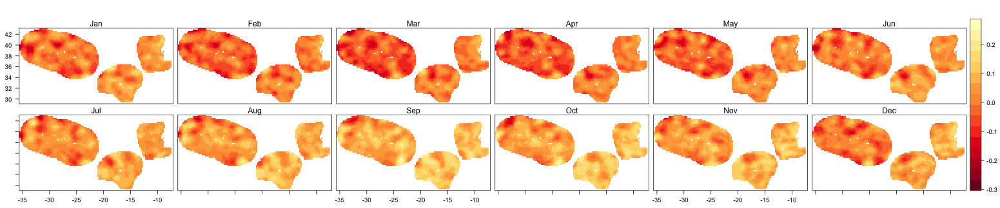
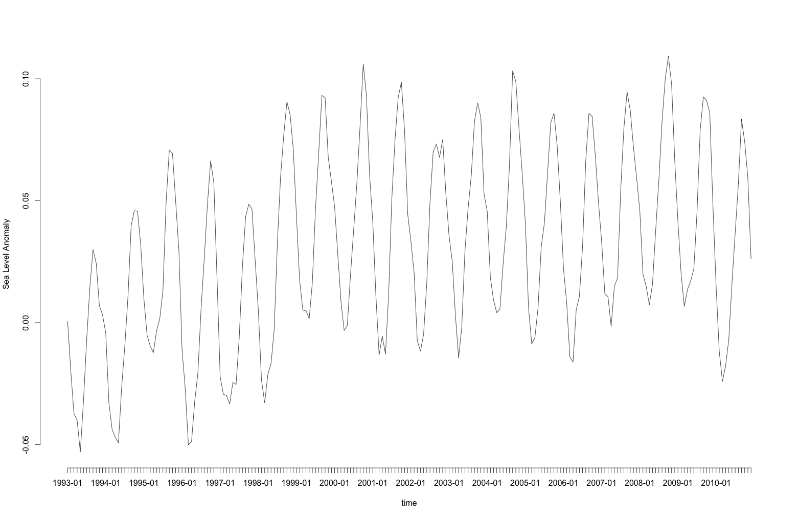

#eowb-cckp

Applications from European contributions to enhance the [World Bank's Climate Change Knowledge Portal](http://sdwebx.worldbank.org/climateportal/index.cfm) by integration of EO-based datasets.

##ReoWBcckp R package

ReoWBcckp is an R package to:

* Ease the access to OGC Web Coverage Service data 
* Access a country Exclusive Economic Zone (EEZ) spatial envelope
* Access Exclusive Economic Zone (EEZ) spatial data using the country ISO code

By putting these features together, extracting data from the European Space Agency (ESA) Climate Change Initiative for a given country becomes straightforward.

### Getting started

The data used in the example has been downloaded from http://www.esa-sealevel-cci.org and exposed as OGC WCS Coverage using [THREDDS](http://www.unidata.ucar.edu/software/thredds/current/tds/).

#### Plotting the Sea Level Anomaly for Portugal's EEZ in 2010

The example code below retrieves the Sea Level Anomaly for Portugal's EEZ in 2010.

```coffee
library(devtools)
library(raster)
install_github("eowb-cckp", username="Terradue", subdir="/src/main/R/ReoWBcckp", ref="dev")
library("ReoWBcckp")

# PRT is Portugal's ISO 3166-1 alpha-3 code
country.code <- "PRT"
# use EEZ or country frontier
use.frontier <- FALSE

# get the WCS GET request template
wcs.template <- GetWCSTemplate()

# fill the values
wcs.template$value[wcs.template$param == "service"] <- "WCS" 
wcs.template$value[wcs.template$param == "version"] <- "1.0.0"
wcs.template$value[wcs.template$param == "request"] <- "GetCoverage"
wcs.template$value[wcs.template$param == "coverage"] <- "sla"
wcs.template$value[wcs.template$param == "format"] <- "NetCDF3"

c.extent <- extent(GetCountryEEZ(country.code))
if(use.frontier){
     c.extent <- extent(GetCountry(country.code))         
}

# check if the country is crossed by the greenwich meridian
split.country <- FALSE  
if(c.extent@xmin<0 & c.extent@xmax>0) {
     split.country <- TRUE
}

# Get Portugal's minimum bounding box for the WCS request
if(use.frontier){
     wcs.template$value[wcs.template$param == "bbox"] <- GetCountryEnvelope(country.code)
} else {
     wcs.template$value[wcs.template$param == "bbox"] <- GetCountryEnvelopeEEZ(country.code)
}

# the list of WCS access points for 2010
coverages <- c(
  "http://catalogue.eowb-cckp.terradue.int/thredds/wcs/SeaLevel-ECV/V1.1_20131220/ESACCI-SEALEVEL-L4-MSLA-MERGED-20100115000000-fv01.nc",
  "http://catalogue.eowb-cckp.terradue.int/thredds/wcs/SeaLevel-ECV/V1.1_20131220/ESACCI-SEALEVEL-L4-MSLA-MERGED-20100215000000-fv01.nc",
  "http://catalogue.eowb-cckp.terradue.int/thredds/wcs/SeaLevel-ECV/V1.1_20131220/ESACCI-SEALEVEL-L4-MSLA-MERGED-20100315000000-fv01.nc",
  "http://catalogue.eowb-cckp.terradue.int/thredds/wcs/SeaLevel-ECV/V1.1_20131220/ESACCI-SEALEVEL-L4-MSLA-MERGED-20100415000000-fv01.nc",
  "http://catalogue.eowb-cckp.terradue.int/thredds/wcs/SeaLevel-ECV/V1.1_20131220/ESACCI-SEALEVEL-L4-MSLA-MERGED-20100515000000-fv01.nc",
  "http://catalogue.eowb-cckp.terradue.int/thredds/wcs/SeaLevel-ECV/V1.1_20131220/ESACCI-SEALEVEL-L4-MSLA-MERGED-20100615000000-fv01.nc",
  "http://catalogue.eowb-cckp.terradue.int/thredds/wcs/SeaLevel-ECV/V1.1_20131220/ESACCI-SEALEVEL-L4-MSLA-MERGED-20100715000000-fv01.nc", 
  "http://catalogue.eowb-cckp.terradue.int/thredds/wcs/SeaLevel-ECV/V1.1_20131220/ESACCI-SEALEVEL-L4-MSLA-MERGED-20100815000000-fv01.nc",
  "http://catalogue.eowb-cckp.terradue.int/thredds/wcs/SeaLevel-ECV/V1.1_20131220/ESACCI-SEALEVEL-L4-MSLA-MERGED-20100915000000-fv01.nc",
  "http://catalogue.eowb-cckp.terradue.int/thredds/wcs/SeaLevel-ECV/V1.1_20131220/ESACCI-SEALEVEL-L4-MSLA-MERGED-20101015000000-fv01.nc",
  "http://catalogue.eowb-cckp.terradue.int/thredds/wcs/SeaLevel-ECV/V1.1_20131220/ESACCI-SEALEVEL-L4-MSLA-MERGED-20101115000000-fv01.nc",
  "http://catalogue.eowb-cckp.terradue.int/thredds/wcs/SeaLevel-ECV/V1.1_20131220/ESACCI-SEALEVEL-L4-MSLA-MERGED-20101215000000-fv01.nc") 


r.stack <- c()

country.frontier <- as(GetCountry(country.code),"SpatialLines")
country.eez <- as(GetCountryEEZ(country.code),"SpatialLines")

# issue on georef for countries with longitudes<0
basePolygon <- readWKT("POLYGON((-180 -90, -180 90, 0 90, 0 -90,-180 -90))")
coordinates <- unlist(strsplit(wcs.template$value[wcs.template$param == "bbox"], ","))
country.polygon <- paste("POLYGON((",   coordinates[1], coordinates[2], ",", coordinates[1], coordinates[4],",",
                                        coordinates[3], coordinates[4], ",", coordinates[3],coordinates[2],",",
                                        coordinates[1], coordinates[2],"))")


if(split.country) {
     
     # the country crosses the Greenwich meridian, need to split the country in 2 parts, the est one and west one
     
     wcs.template.west <- wcs.template
     wcs.template.est <- wcs.template
     wcs.template.west$value[wcs.template.west$param == "bbox"] <- paste(coordinates[1],coordinates[2],0,coordinates[4],sep=",")
     wcs.template.est$value[wcs.template.est$param == "bbox"] <- paste(0,coordinates[2],coordinates[3],coordinates[4],sep=",")
     
     west.country.extent <- c.extent
     est.country.extent <- c.extent
     west.country.extent@xmax <- 0
     est.country.extent@xmin <- 0

     if(use.frontier){
          country.west<-crop(GetCountry(country.code), west.country.extent)
          country.est<-crop(GetCountry(country.code), est.country.extent)
     } else {
          country.west<-crop(GetCountryEEZ(country.code), west.country.extent)
          country.est<-crop(GetCountryEEZ(country.code), est.country.extent)
     }
     
     
     for (coverage in coverages) {
          # get the coverage by value (a netcdf)  
          
          # est part of the country
          r.est <- GetWCSCoverage(coverage, wcs.template.est, by.ref=FALSE)
          r.est.mask.shift <- mask(r.est , country.est)
          
          # west part of the country
          r.west <- GetWCSCoverage(coverage, wcs.template.west, by.ref=FALSE)

          # issue on georef for countries with longitudes<0
          r.west.shift <- shift(r.west, x=-360,y=0)
          r.west.mask.shift <- mask(r.west.shift, country.west)
          
          if(use.frontier) {
               # put the 2 raster together 
               r.mask <- merge(r.west.mask.shift, r.est.mask.shift, tolerance = 0.1, ext=c.extent)
               # get data along the frontier
               cr <- crop(r.mask, extent(country.frontier), snap="near")                    
               fr <- rasterize(country.frontier, cr)   
               lr <- mask(x=cr, mask=fr)     
               r.stack <- c(r.stack, lr)
          }else {
               # extract the values for the country frontier
               # put the 2 raster together 
               r.mask <- merge(r.west.mask.shift, r.est.mask.shift, tolerance = 0.1, ext=c.extent)
               # add the clipped raster to the stack
               r.stack <- c(r.stack, r.mask)
          }
     }
}else {
     # country completly in the est or west part
     x.shift <- 0
     if(gContains(basePolygon, readWKT(country.polygon)))
          x.shift <- -360
     # issue on georef for countries with longitudes<0
     
     for (coverage in coverages) {
          # get the coverage by value (a netcdf)  
          r <- GetWCSCoverage(coverage, wcs.template, by.ref=FALSE)
          r.shift <- shift(r, x=x.shift,y=0)
          
          if(usefrontier) {
               r.mask <- mask(r.shift, GetCountry(country.code))              
               # get data along the frontier
               cr <- crop(r.mask, extent(country.frontier), snap="near")                    
               fr <- rasterize(country.frontier, cr)   
               lr <- mask(x=cr, mask=fr)     
               r.stack <- c(r.stack, lr)
          }else {
               # extract the values for the EEZ
               # put the 2 raster together 
               r.mask <- mask(r.shift, GetCountryEEZ(country.code))
               # add the clipped raster to the stack
               r.stack <- c(r.stack, r.mask)
          }
     }
}

# visualize with rasterVis package
library(rasterVis)

# create the monthly indexes and assign the month abbreviation to rasters  
idx <- seq(as.Date('2010-01-15'), as.Date('2010-12-15'), 'month')
my.stack <- setZ(stack(r.stack), idx)
names(my.stack) <- month.abb

# do a nice plot
levelplot(my.stack,layout=c(6, 2))

```

The image generated by the code above is:



#### Plotting the Sea Level Anomaly for Portugal from 1993 to 2011

```coffee
library(devtools)
install_github("rOpenSearch", username="Terradue", subdir="/src/main/R/rOpenSearch")
library(rOpenSearch)

library(httr)
library(XML)
library(stringr)
library(RCurl)

# the country
country.code <- "PRT"

# the time period
start.date <- "1993-01-01"
end.date <- "2011-12-31"

## Query the catalogue
osd.url <- "http://catalogue.eowb-cckp.terradue.int/catalogue/search/SeaLevel-ECV/description"
response.type <- "application/rdf+xml"

df.params <- GetOSQueryables(osd.url, response.type)

df.params$value[df.params$type == "count"] <- 300 
df.params$value[df.params$type == "time:start"] <- start.date
df.params$value[df.params$type == "time:end"] <- end.date 

# submit the query
res <- Query(osd.url, response.type, df.params)

# create a named list with the WCS online resources and associated start date 
coverages <- list(online.resource=rev(xpathSApply(xmlParse(res), "//dclite4g:DataSet/dclite4g:onlineResource/ws:WCS/@rdf:about")), 
      start=rev(xpathSApply(xmlParse(res), "//dclite4g:DataSet/ical:dtstart", xmlValue)))

wcs.template <- GetWCSTemplate()

wcs.template$value[wcs.template$param == "service"] <- "WCS" 
wcs.template$value[wcs.template$param == "version"] <- "1.0.0"
wcs.template$value[wcs.template$param == "request"] <- "GetCoverage"
wcs.template$value[wcs.template$param == "coverage"] <- "sla"
wcs.template$value[wcs.template$param == "format"] <- "NetCDF3"

wcs.template$value[wcs.template$param == "bbox"] <- GetCountryEnvelopeEEZ(country.code)


r.stack <- c()
idx <- c()
for (i in 1:length(coverages$online.resource)) {

  # get the coverage 
  r <- GetWCSCoverage(coverages$online.resource[i], wcs.template, by.ref=FALSE)
  
  # issue on georef for contries with longitudes<0
  r.shift <- shift(r, x=-360,y=0)
  
  # clip with the country EEZ
  r.mask <- mask(r.shift, GetCountryEEZ(country.code))
  
  # add the clipped raster to the list
  r.stack <- c(r.stack, r.mask)
  
  # update the index
  idx <- c(idx, format(as.Date(coverages$start[i]), format="%Y-%m"))
  
  # delete the WCS downloaded raster (the clipped rasters are in memory)
  file.remove(r@file@name)
  
}

my.stack <- setZ(stack(r.stack), idx)
names(my.stack) <- idx

plot(cellStats(my.stack, 'mean'), type="l", ylab="Sea Level Anomaly", xlab="time", axes=FALSE, ann=TRUE)
axis(1, at=1:length(idx), lab=idx)
axis(side=2)
```

The image generated by the code above is:




## Questions, bugs, and suggestions

Please file any bugs or questions as [issues](https://github.com/Terradue/eowb-cckp/issues/new) or send in a pull request.
