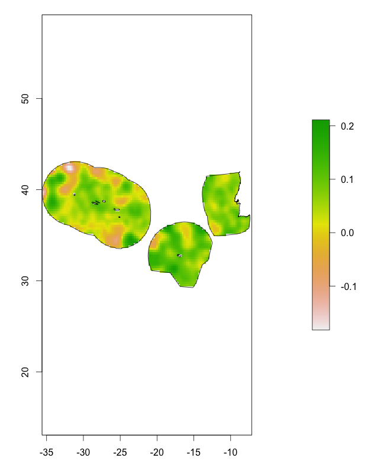

#eowb-cckp

Applications to enhance the [World Bank CCKP Portal](http://sdwebx.worldbank.org/climateportal/index.cfm) by integration of European EO-based datasets

##ReoWBcckp R package

ReoWBcckp is an R package to:

* Ease the access to OGS Web Coverage Service data 
* Access Exclusive Economic Zone (EEZ) spatial data

By putting those features together, extracting the European Space Agency (ESA) Climate Change Initiative data for a given country becomes straightforward.

The example code below show the Sea Level Anomaly mean value for august 2010: 

```coffee
library(devtools)
library(raster)
install_github("eowb-cckp", username="Terradue", subdir="/src/main/R/ReoWBcckp", ref="dev")
library("ReoWBcckp")

country.code <- "PRT"

wcs.template <- GetWCSTemplate()

wcs.template$value[wcs.template$param == "service"] <- "WCS" 
wcs.template$value[wcs.template$param == "version"] <- "1.0.0"
wcs.template$value[wcs.template$param == "request"] <- "GetCoverage"
wcs.template$value[wcs.template$param == "coverage"] <- "sla"
wcs.template$value[wcs.template$param == "format"] <- "NetCDF3"
wcs.template$value[wcs.template$param == "bbox"] <- GetCountryEnvelope(country.code)

r <- GetWCSCoverage("http://catalogue.eowb-cckp.terradue.int/thredds/wcs/SeaLevel-ECV/V1.1_20131220/ESACCI-SEALEVEL-L4-MSLA-MERGED-20100815000000-fv01.nc", 
  wcs.template, by.ref=FALSE)

ra <- shift(r, x=-360,y=0)
r.mask <- mask(ra, GetCountryEEZ(country.code))

plot(r.mask)
plot(GetCountryEEZ(country.code), add=TRUE)

prt_mean_sla <- cellStats(r.mask, 'mean')
```

The image generated by the code above is shown below.



The data used in the example has been downloaded from (www.esa-sealevel-cci.org) and exposed as an OGC WCS Coverage using THREDDS.


## Questions, bugs, and suggestions

Please file any bugs or questions as [issues](https://github.com/Terradue/eowb-cckp/issues/new) or send in a pull request.
